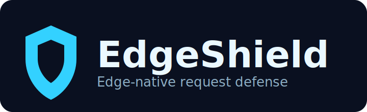

# EdgeShield



[](https://www.npmjs.com/package/edgeshield)
[](https://github.com/jose-compu/edgeshield/actions/workflows/ci.yml)
[](https://github.com/jose-compu/edgeshield)
[](./LICENSE)
[](https://www.typescriptlang.org/)

Edge-native security toolkit for modern TypeScript runtimes.

Current release scope: `v0.4.0` adds challenge mode, generic middleware, composite presets, Deno KV, and multi-runtime CI.

## Install

```bash
npm install edgeshield
```

## Quick Start

```ts
import { rateLimit, slidingWindow } from "edgeshield/ratelimit";
import { memory } from "edgeshield/storage/memory";

const limiter = rateLimit({
  storage: memory(),
  algorithm: slidingWindow(100, "15m")
});

const result = await limiter.check(request);
if (!result.success) {
  return new Response("Too Many Requests", { status: 429, headers: result.headers });
}
```

## Bot Guard (v0.2.0)

```ts
import { botGuard } from "edgeshield/bot";

const guard = botGuard({
  mode: "block",
  threshold: 60,
  rules: {
    allow: [/googlebot/i, /bingbot/i],
    block: [/curl/i, /python-requests/i, /scrapy/i]
  }
});

const bot = await guard.check(request);
if (!bot.success) {
  return new Response("Forbidden", { status: 403, headers: bot.headers });
}
```

## Sloth VDF Challenge

```ts
import { botGuard, VDF } from "edgeshield/bot";

const guard = botGuard({
  mode: "block",
  threshold: 40,
  vdf: { enabled: true, steps: 20, maxAgeMs: 300000 }
});

const first = await guard.check(request);
if (first.reason === "vdf_challenge_required") {
  const challenge = first.headers.get("x-edgeshield-vdf-challenge");
  const steps = Number(first.headers.get("x-edgeshield-vdf-steps"));
  const challengeHex = challenge?.split(".")[0] ?? "";
  const proof = await VDF.compute(challengeHex, steps);
  // Send challenge + proof headers in the next request:
  // x-edgeshield-vdf-challenge: <challenge>
  // x-edgeshield-vdf-solution: <proof>
}
```

## Bot Challenge Mode

Use `mode: "challenge"` for browser traffic. Suspicious clients receive a self-contained HTML page that runs the Sloth VDF check client-side and retries automatically.

```ts
import { botGuard } from "edgeshield/bot";
import { memory } from "edgeshield/storage/memory";

const guard = botGuard({
  mode: "challenge",
  threshold: 60,
  storage: memory(), // optional: one-time solution anti-replay
  vdf: { steps: 20, maxAgeMs: 300_000 },
  challenge: {
    renderer: (context) => `<html>...</html>` // optional custom HTML override
  }
});

const result = await guard.check(request);
if (!result.success && result.body) {
  return new Response(result.body, {
    status: 403,
    headers: result.headers
  });
}
```

Next.js and Hono middleware return the HTML challenge page automatically when `body` is present on the guard result.

Sloth VDF core is adapted from [dignity.js](https://github.com/jose-compu/dignity.js) (Apache-2.0).

## Cloudflare KV Adapter

```ts
import { cloudflareKV } from "edgeshield/storage/cloudflare-kv";
import { rateLimit, slidingWindow } from "edgeshield/ratelimit";

const storage = cloudflareKV({ binding: env.EDGE_KV, prefix: "edgeshield" });
const limiter = rateLimit({
  storage,
  algorithm: slidingWindow(100, "15m")
});
```

## CSRF Guard (v0.3.0)

```ts
import { csrfGuard } from "edgeshield/csrf";

const csrf = csrfGuard({
  mode: "double-submit",
  secret: process.env.CSRF_SECRET!,
  ttl: "1h",
  ignorePaths: ["/api/webhooks/**"]
});

const token = await csrf.generate(request);
const cookie = csrf.buildCookie(token);

const verify = await csrf.verify(request);
if (!verify.valid) {
  return new Response("Forbidden", { status: 403 });
}
```

## Vercel KV Adapter

```ts
import { vercelKV } from "edgeshield/storage/vercel-kv";

const storage = vercelKV({
  client: kv,
  prefix: "edgeshield"
});
```

## Deno KV Adapter

```ts
import { denoKV } from "edgeshield/storage/deno-kv";

const kv = await Deno.openKv();
const storage = denoKV({ kv, prefix: "edgeshield" });
```

Requires Deno 1.32+ or Deno Deploy with the `Deno.openKv()` API available.

## Hono Middleware

```ts
import { Hono } from "hono";
import { edgeshield } from "edgeshield/middleware/hono";
import { rateLimit, slidingWindow } from "edgeshield/ratelimit";
import { botGuard } from "edgeshield/bot";

const app = new Hono();

app.use(
  "/api/*",
  edgeshield(
    rateLimit({ storage, algorithm: slidingWindow(100, "15m") }),
    botGuard({ mode: "block", threshold: 60 })
  )
);
```

## Generic Middleware

Works with any framework that uses Web Standard `Request` / `Response`:

```ts
import { shield } from "edgeshield/middleware/generic";
import { rateLimit, slidingWindow } from "edgeshield/ratelimit";
import { botGuard } from "edgeshield/bot";

const protect = shield(
  rateLimit({ storage, algorithm: slidingWindow(100, "15m") }),
  botGuard({ mode: "block", threshold: 60 })
);

const blocked = await protect(request);
if (blocked) return blocked;
```

## Presets

```ts
import { presets } from "edgeshield/presets";
import { memory } from "edgeshield/storage/memory";

const storage = memory();

// Rate-limit-only presets
const apiLimiter = presets.api({ storage, limit: 100, window: "15m" });
const authLimiter = presets.auth({ storage });
const pageLimiter = presets.page({ storage });

// Composite shields (rate limit + bot + optional CSRF)
const apiShield = presets.apiShield({
  storage,
  csrfSecret: process.env.CSRF_SECRET
});
const authShield = presets.authShield({
  storage,
  csrfSecret: process.env.CSRF_SECRET!
});
const pageShield = presets.pageShield({ storage });
```

## Custom Storage Adapter

Every adapter implements four methods against the shared contract:

```ts
import type { StorageAdapter } from "edgeshield";

export function createMyAdapter(client: MyKVClient): StorageAdapter {
  return {
    get: (key) => client.get(key),
    set: (key, value, ttlMs) => client.set(key, value, { px: ttlMs }),
    increment: async (key, ttlMs) => {
      const next = await client.incr(key);
      await client.pexpire(key, ttlMs);
      return next;
    },
    delete: (key) => client.del(key)
  };
}
```

Contract notes:

- Keys are namespaced by guards via `prefix` (for example `edgeshield:api:<identifier>`).
- `increment` must return the new counter value and honour TTL on first write.
- `set` TTL is in milliseconds; expired keys should behave as missing on `get`.
- Rate limiting fail-opens by default when storage throws (`failOpen: true`).

Reference implementations: `edgeshield/storage/memory`, `upstash`, `cloudflare-kv`, `vercel-kv`, `deno-kv`.

All adapters run through a shared conformance suite in CI (`test/storage/adapterConformance.test.ts`).

## Supported Runtimes

| Runtime | CI job | Notes |
|---|---|---|
| Node.js 20/22 | `test` | lint, typecheck, coverage, build, size check |
| Bun | `bun` | `bun run test` against source |
| Deno 2.x | `deno` | smoke tests against built `dist/` output |

Local commands:

```bash
npm run test:bun
npm run build && npm run test:deno
```

## Features in v0.4.0

- Sliding and fixed window algorithms
- Multi-tier rate limiting
- Bot detection (`detect`, `block`, and `challenge` modes)
- Sloth VDF challenge support for suspicious bot traffic
- CSRF protection (`double-submit` and `origin-check`)
- Memory, Upstash, Cloudflare KV, Vercel KV, and Deno KV adapters
- Next.js, Hono, and generic middleware helpers
- Configuration presets and composite shields
- Bundle size budget enforced in CI (`npm run size:check`)
- TypeScript-first API

## Comparison

Note: the table reflects the full product vision across roadmap versions.

| Feature | edgeshield | @upstash/ratelimit | rate-limiter-flexible | express-rate-limit |
|---|---|---|---|---|
| Edge-native (no Node APIs) | Yes | Yes | No | No |
| Storage-agnostic | Yes | Upstash only | Redis/Mongo/Postgres | Memory/Redis |
| Rate limiting | Yes (`v0.1.0`) | Yes | Yes | Yes |
| Bot detection | Yes (`v0.2.0`) | No | No | No |
| CSRF protection | Yes (`v0.3.0`) | No | No | No |
| Tree-shakeable subpaths | Yes | No | No | No |
| Zero dependencies | Yes | Needs @upstash/redis | 0 deps (core) | 0 deps |
| Bundle size target | < 4 KB (core ratelimit subpath, enforced in CI) | ~8 KB | ~15 KB | ~5 KB |

## Roadmap

- `v0.1.0` — Core rate limiting + memory + upstash adapters + Next.js middleware
- `v0.2.0` — Bot detection module + Cloudflare KV adapter
- `v0.3.0` — CSRF module + Hono middleware + Vercel KV adapter
- `v0.4.0` — Challenge mode, generic middleware, presets, Deno KV adapter, conformance suite, multi-runtime CI
- `v1.0.0` — Stable API, full docs site, all adapters battle-tested

## Build And Test

```bash
npm run build
npm run size:check
npm run test:coverage
npm run security:audit
```

## Publish

Tag a release to trigger the GitHub Actions publish workflow (requires `NPM_TOKEN` secret):

```bash
npm run lint
npm run typecheck
npm run test:coverage
npm run build
npm run size:check
npm version minor
git push --follow-tags
```

Manual publish:

```bash
npm run prepublishOnly
npm publish --access public
```
